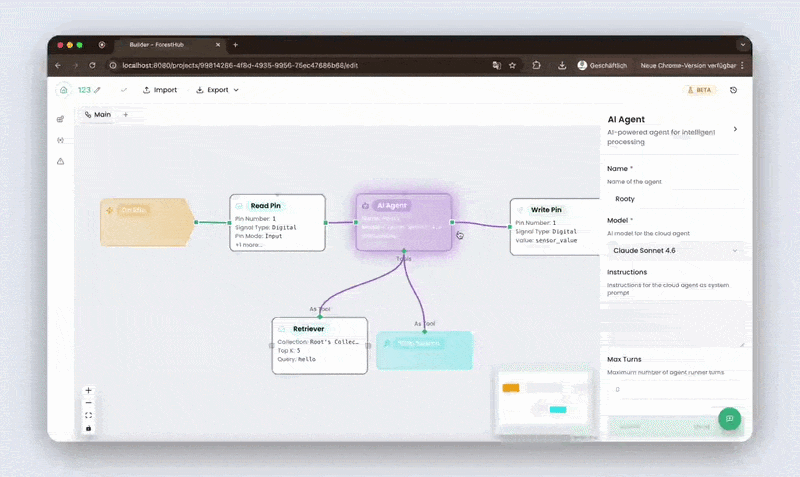

# edge-agents

**The 15 MB open-source AI agent runtime for edge devices.**

[](https://github.com/ForestHubAI/edge-agents/actions/workflows/ci.yml)
[](https://pkg.go.dev/github.com/ForestHubAI/edge-agents/go)
[](LICENSE)



Offline by default. GPIO, MQTT, OPC-UA as first-class nodes. Local SLMs alongside cloud LLMs in the same workflow.

> Today's AI agents live in datacenters. The interesting workloads — sensors, machines, vehicles, gateways — live everywhere else. **edge-agents** brings the agent paradigm to the devices that interact with the real world: small enough to run on a Pi 5, capable enough to drive an industrial controller, with hardware I/O as native primitives instead of REST shims.

## What you can build

- **Voice assistant on a Pi with a local SLM** — wake-word → STT → agent → TTS, no internet required
- **Predictive maintenance on industrial gear** — live OPC-UA vibration stream → LLM decides → MQTT alert
- **Local RAG on a Jetson** — agent answers grounded in live sensor and machine state, not the public web

## edge-agents vs other agent frameworks

|                                             | edge-agents             | n8n             | LangGraph        | Dify           | OpenClaw           |
| ------------------------------------------- | ----------------------- | --------------- | ---------------- | -------------- | ------------------ |
| **Runtime size**                            | 15 MB container         | ~500 MB Docker  | Python library   | ~500 MB Docker | ~1 GB Docker       |
| **Offline by default**                      | ✅                      | ❌              | depends on host  | ❌             | ❌ datacenter-only |
| **Hardware I/O (GPIO, UART, ADC) as nodes** | ✅ first-class          | ❌              | ❌               | ❌             | ❌                 |
| **On-device SLM provider**                  | ✅ typed multi-endpoint | ❌              | partial via libs | ❌             | ❌                 |
| **MQTT as workflow transport**              | ✅ first-class          | community node  | ❌               | ❌             | ❌                 |
| **Visual builder**                          | ✅                      | ✅              | ❌ code-only     | ✅             | ❌                 |
| **Industrial protocols** (OPC-UA, Modbus)   | on roadmap              | community nodes | ❌               | ❌             | ❌                 |

---

# Using edge-agents

Two pieces: the **engine** (a small container that runs your workflows) and the
**`fh-workflow` CLI** (authors, validates, and visually edits workflow files). You can
run the engine without ever cloning this repo, and author workflows with a single
`npm i -g @foresthubai/workflow-cli`.

## Run the engine

The engine ships as a small container you build from [`go/Dockerfile`](go/Dockerfile)
(multi-arch, distroless, nonroot). Most edge targets are `arm64` (Pi, Jetson, STM32MP2,
ctrlX), so the common flow is to cross-build on an `amd64` workstation and ship the
result to the device:

```sh
cd go

# Cross-build for an arm64 edge device (use --platform linux/amd64 for x86 targets)
docker buildx build --platform linux/arm64 -t edge-agents/engine:arm64 --load .

# Ship to an offline device: save to a tar, copy it across, load it there
docker save edge-agents/engine:arm64 -o edge-agents-engine-arm64.tar
#   scp edge-agents-engine-arm64.tar device:/tmp/   ← then, on the device:
docker load -i edge-agents-engine-arm64.tar
docker run --rm -p 8081:8081 edge-agents/engine:arm64
```

Building for the same architecture you're already on? A plain
`docker build -t edge-agents/engine:dev .` works too — the Dockerfile cross-compiles via
`TARGETARCH`, so QEMU only emulates the trivial copy into the final layer.

The engine HTTP API listens on `:8081`. It runs **standalone by default** — no control
plane, no account, no outbound calls beyond LLM provider APIs. Configure via `ENGINE_*`
env vars; see [`go/cmd/engine/config.go`](go/cmd/engine/config.go).

## Author workflows

A workflow is a `*.workflow.json` file you author, validate, and open in the visual
builder. Install the `fh-workflow` CLI from npm — no clone required:

```sh
npm i -g @foresthubai/workflow-cli
# or run it without installing:
npx @foresthubai/workflow-cli <command>
```

```sh
fh-workflow open my.workflow.json          # open the visual builder; Save writes back to the file
fh-workflow validate my.workflow.json      # semantic: wiring, references, types
fh-workflow check-schema my.workflow.json  # structural: types, required fields, enums
fh-workflow update my.workflow.json        # migrate a workflow to the current schema version
fh-workflow help                           # list all commands
```

`fh-workflow open` _is_ the visual builder — the same React Flow canvas, served locally;
hit Save and it writes straight back to your file. See [`ts/workflow-cli`](ts/workflow-cli)
for the full command reference and the `--static` / `--dev` open modes.

## Generate workflows with Claude Code

Describe a workflow in plain language and the **`workflow-generate`** skill writes the
`*.workflow.json` and runs the validators for you. Install it into any project with the
[`skills`](https://github.com/vercel-labs/skills) CLI — no clone required:

```sh
npx skills add ForestHubAI/edge-agents --skill workflow-generate
```

The skill validates by shelling out to the `fh-workflow` CLI, so install that too
(`npm i -g @foresthubai/workflow-cli`). Then just describe a workflow — e.g.
_"read a sensor every 10s and toggle a relay"_ — and the skill generates and validates
the file for you.

## Deploy a workflow to a device

A workflow is **binding-free**: it declares _what_ it needs — channels (GPIO, MQTT, …)
and custom models — but not _where_ those live on a given device. You supply the _where_
through a few small config files mounted into the engine container alongside the
workflow. See [`go/docs/deployment-layers.md`](go/docs/deployment-layers.md) for the file
schemas and deploy-time validation rules.

What the engine reads, and when each file is needed:

| File               | Engine env var                   | When you need it                                                                                               |
| ------------------ | -------------------------------- | -------------------------------------------------------------------------------------------------------------- |
| workflow JSON      | `ENGINE_CONFIG_FILE`             | always — the graph itself                                                                                      |
| device manifest    | `ENGINE_DEVICE_MANIFEST_FILE`    | only with hardware channels (GPIO / ADC / DAC / PWM / UART) — maps a logical id to a physical `/dev/…`         |
| external resources | `ENGINE_EXTERNAL_RESOURCES_FILE` | only with MQTT channels or custom/self-hosted models — broker connections and LLM endpoints                    |
| deployment mapping | `ENGINE_DEPLOYMENT_MAPPING_FILE` | as soon as any channel **or** custom model exists — binds each logical id to a resource (+ index for hardware) |

**Rule of thumb:** a workflow with no channels and only built-in catalog models (e.g.
`claude-haiku-4-5`) needs none of the extra files — just the workflow JSON and the
provider's API key. Add the mapping the moment a channel or a custom model appears; add
the device manifest for hardware, external resources for MQTT and self-hosted models.

Ship the image with the `docker save` / `docker load` flow from
[Run the engine](#run-the-engine), mount the files above, and start it with
`docker compose up`.

## Features

- **Workflow engine** — typed graph runtime; nodes for LLM calls, hardware I/O, MQTT, web search, memory, control flow.
- **Multi-provider LLMs** — Anthropic, OpenAI, Google Gemini, Mistral, plus a local SLM provider for `llama.cpp` / `vLLM` / `Ollama` / any OpenAI-compatible endpoint.
- **Visual React Flow builder** — embeddable component or runnable as bundled SPA, with typed parameters and live validation.
- **Contract-typed wire format** — every API generated from `contract/*.yaml` for both Go and TypeScript; CI fails on schema drift.

## Local models (self-hosted SLMs)

To run a model on the device, use **`llama.cpp`**: pull its server image and run it as its
own container serving a `.gguf` model file (e.g. a quantized Gemma):

```sh
docker pull ghcr.io/ggml-org/llama.cpp:server-b8589

docker run --rm --network host -v "$PWD/models:/models:ro" \
  ghcr.io/ggml-org/llama.cpp:server-b8589 \
  --model /models/gemma-3-270m-it-Q4_0.gguf --host 0.0.0.0 --port 8090
```

The model runs in **its own container, separate from the engine** — start it before the
engine, or bring both up together with `docker compose`. In the workflow you reference the
model as a **custom `LLMModel`** and point it at this endpoint through the deploy files
(see [Deploy a workflow to a device](#deploy-a-workflow-to-a-device)).

## Hardware and transports

- **GPIO** via `go-gpiocdev` (digital in/out, edge triggers)
- **ADC / DAC / PWM** via Linux character-device interfaces
- **UART / serial** via `go.bug.st/serial`
- **MQTT** via Eclipse Paho — topic-scoped channels for device-to-device messaging
- **Web search** as a pluggable node

Digital and analog signal types are first-class in the workflow contract.

## Tested targets

| Target                         | Status                                                                                         |
| ------------------------------ | ---------------------------------------------------------------------------------------------- |
| Raspberry Pi 5 (8 GB)          | ✅                                                                                             |
| NVIDIA Jetson Orin Nano (8 GB) | ✅                                                                                             |
| x86 NUC (16 GB)                | ✅                                                                                             |
| STM32MP25 (1 GB, Linux MCU)    | ✅                                                                                             |
| Bosch Rexroth ctrlX CORE       | ✅                                                                                             |
| Other Linux `amd64` / `arm64`  | Works, untested                                                                                |
| macOS `arm64` / `amd64`        | Supported (development)                                                                        |
| Bare-metal MCU (Cortex-M)      | Not supported by the Go engine. Contract is portable; dedicated MCU runtime is on the roadmap. |

---

# Developing edge-agents

Want to hack on the engine, the builder, or the contract? Clone the repo — `go/` and
`ts/` are independently buildable and releasable; only `contract/` edits touch both.

```sh
git clone https://github.com/ForestHubAI/edge-agents
cd edge-agents
```

## Build from source

**Go engine** (requires the Go version pinned in [`go/go.mod`](go/go.mod)):

```sh
cd go
go build ./cmd/engine
./engine                 # runs standalone by default
go test ./...            # testify-based tests
```

**TypeScript packages** (Node ≥ 20):

```sh
cd ts
npm ci
npm run dev              # Vite dev server with the visual builder → http://localhost:5173
npm run build            # build all three packages
npm run typecheck && npm run lint && npm test
```

**The CLI from your working tree** — the root `package.json` delegates to
`ts/workflow-cli`, so a single root `npm install` (its `postinstall` builds the `ts/`
toolchain) runs the validators against your local changes instead of the published
package:

```sh
npm install
npm run check-schema -- my.workflow.json   # the -- passes the path to the CLI, not to npm
npm run validate    -- my.workflow.json
npm run open        -- my.workflow.json
```

After a `git pull` that changed dependencies, just run `npm install` again. If a stale
`node_modules` bites you after switching branches, do a clean reinstall:

```sh
rm -rf node_modules ts/node_modules && npm install
```

## Contract is the source of truth

Every API type is generated from [`contract/*.yaml`](contract) for **both** Go and
TypeScript — CI fails on drift. Never hand-edit generated bindings; edit the contract,
then regenerate both sides:

```sh
cd go && go generate ./...     # → go/api/*/types.gen.go, server.gen.go
cd ts && npm run generate      # → ts/workflow-core/src/api/workflow.ts
```

See [`go/CLAUDE.md`](go/CLAUDE.md) and [`ts/CLAUDE.md`](ts/CLAUDE.md) for the full
contributor guide, conventions, and the domain-layer reconciliation each side needs.

## Architecture

A workflow is a directed graph of typed nodes — LLM call, hardware I/O, MQTT, memory, control flow, expressions — connected by edges with one of five types: `control`, `tool`, `agentTask`, `agentChoice`, `agentDelegate`. The engine interprets the graph as a state machine: wait for event → execute node → transition. The contract (`contract/*.yaml`) is the single source of truth — Go and TypeScript both regenerate from it, CI fails on drift.

See [`go/CLAUDE.md`](go/CLAUDE.md) and [`ts/CLAUDE.md`](ts/CLAUDE.md) for deeper architecture notes.

## Repository layout

| Path                                         | What it contains                                                                                            |
| -------------------------------------------- | ----------------------------------------------------------------------------------------------------------- |
| [`contract/`](contract)                      | OpenAPI 3.0.3 schemas — single source of truth for Go and TS.                                               |
| [`go/`](go)                                  | Engine binary, LLM proxy, hardware drivers, MQTT transport. Module `github.com/ForestHubAI/edge-agents/go`. |
| [`ts/workflow-core`](ts/workflow-core)       | `@foresthubai/workflow-core` — headless workflow model, validation, (de)serialization. No React.            |
| [`ts/workflow-builder`](ts/workflow-builder) | `@foresthubai/workflow-builder` — React canvas component.                                                   |
| [`ts/workflow-cli`](ts/workflow-cli)         | `@foresthubai/workflow-cli` — the `fh-workflow` CLI + the reference SPA it serves.                          |

## Releases

- **Go runtime** — tagged `go/vX.Y.Z`; consume with `go get github.com/ForestHubAI/edge-agents/go@vX.Y.Z`.
- **TypeScript packages** — `@foresthubai/workflow-core`, `@foresthubai/workflow-builder`, and `@foresthubai/workflow-cli` ship in lockstep at the same version, published to public npm.
- **Container image** — built from [`go/Dockerfile`](go/Dockerfile): multi-arch (`linux/amd64`, `linux/arm64`), distroless, nonroot. Build it yourself (see [Run the engine](#run-the-engine)).

See [RELEASING.md](RELEASING.md).

## Contributing

See [CONTRIBUTING](.github/CONTRIBUTING.md) and the [Code of Conduct](.github/CODE_OF_CONDUCT.md). Open an issue before any non-trivial change. Every contribution is accepted under a Contributor License Agreement that preserves the dual-licensing model.

## Security

Do not open public issues for security vulnerabilities. Use [GitHub private vulnerability reporting](https://github.com/ForestHubAI/edge-agents/security/advisories/new) or email **root@foresthub.ai**. See [SECURITY.md](.github/SECURITY.md) for scope and process.

---

## License

`edge-agents` uses a **two-tier license model** designed to make the wire format and the headless workflow model maximally reusable while keeping the engine and the visual builder protected under copyleft.

| Component                                                                          | License                             | Why                                                                                                                                       |
| ---------------------------------------------------------------------------------- | ----------------------------------- | ----------------------------------------------------------------------------------------------------------------------------------------- |
| [`contract/`](contract) (OpenAPI schemas)                                          | **Apache-2.0**                      | Wire format. Third-party Python, Rust, or Java clients should be free to implement against it.                                            |
| [`ts/workflow-core`](ts/workflow-core) (headless model)                            | **Apache-2.0**                      | Workflow model and validation. Same reasoning — should be embeddable into any TypeScript/JavaScript project without copyleft friction.    |
| [`go/`](go) (engine, LLM proxy, drivers)                                           | **AGPL-3.0-only** or **commercial** | Keeps hosted "edge-agents as a service" offerings honest. For commercial use cases incompatible with AGPL, contact **root@foresthub.ai**. |
| [`ts/workflow-builder`](ts/workflow-builder) (React canvas)                        | **AGPL-3.0-only** or **commercial** | Same dual-license terms as the engine.                                                                                                    |
| [`ts/workflow-cli`](ts/workflow-cli) (`@foresthubai/workflow-cli` + reference SPA) | **AGPL-3.0-only** or **commercial** | Bundles the AGPL builder; same dual-license terms.                                                                                        |

For the AGPL components, the AGPL network clause applies — providing a modified version over a network requires making the corresponding source available to users of that service.

Third-party components retain their own licenses; see [THIRD_PARTY_NOTICES](THIRD_PARTY_NOTICES) and [NOTICE](NOTICE).

---

Built by [ForestHub](https://foresthub.ai) — the platform for embedded and edge AI agents.
